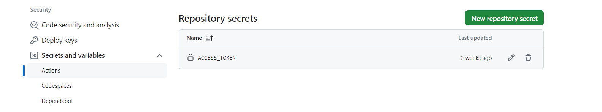

# Github IF score label

## Introduction

This plugin designed to simplify the creation of a GitHub Action workflow. This workflow incorporates final scores generated from an Impact Framework YML file. After defining the specific values for broadcasting, this workflow appends them into your Github project's README.md file.

## Scope

This plugin uses the utility of GitHub Actions within the measured project repository. Its ultimate goal is to generate a workflow that appends Impact Framework (IF) output values to project's README.md, it's critical to configure a GitHub personal token with appropriate permissions.

- The personal GitHub token needs the "repo" scope permission: [GitHub's Developer settings](https://github.com/settings/apps)

- Add a GitHub token to a repository's secrets: [Secret setting within the repo](https://github.com/seedstarter/front-ui/settings/secrets/actions)
  

- The plugin will generate an 'update-readme.yml' workflow file in the root directory of the Impact Framework project.
  Once generated it can be moved to a relevant project .github\workflows folder, within a GitHub _branch_ and subsequently push it to the repository.

- The workflow will be triggered on push, updating README.md with IF scores and the IF logo within the branch where the workflow YML file was pushed. Afterward, a pull request will need to be opened and merged.

### Manifest Usage

- As this plugin relies on the node's process "beforeexit", it should be configured as the final step in the pipeline.
- The input parameters are specified under the 'config' property in the YML manifest file.

```yaml
tree:
  children:
    child:
      pipeline:
        - sci-m
        - github-actions-importer
      config:
        github-actions-importer:
          github/output-value-0: 'carbon-embodied'
          github/output-value-1: 'device/emissions-embodied'
```

## Caveat

- When granting "repo" scope permission for github's personal token, it provides broad access to repository content and settings.
- To prevent the repetition of appending the same IF values to README.md, it's crucial to delete the workflow not only from the repository in GitHub Actions but also from the specific branch where it was pushed.
